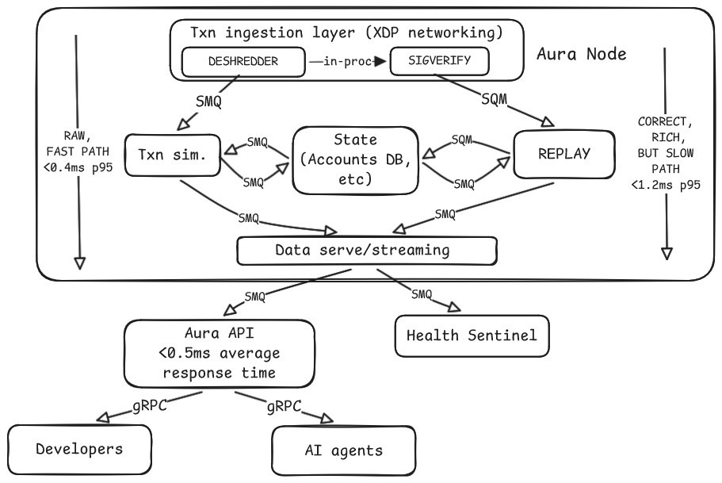

# Aura API Client

Rust client types and gRPC bindings for the Aura trading API.

- Landing page: [https://aura.rehab](https://aura.rehab)
- API endpoint: `http://trade.aura.rehab:40051`
- Telegram bot: [https://t.me/trade_with_aura_bot](https://t.me/trade_with_aura_bot) (`@trade_with_aura_bot`) - get API key here, in `API | Extension tab`, (Use it with the `auth` header (`auth` is key) in gRPC metadata.)

The Telegram bot is the fastest way to start trading with Aura. The API is for builders, power users, and automation: it exposes the same product surface with much finer and richer control than the Telegram UI

## What the API gives you

The Aura API gives full control over the trading features behind the bot (and some data endpoints too), including:

- All kind of trades through Aura's trading router (ARB endpoint coming soon!).
- UTILITY transactions: wrap SOL, unwrap WSOL, open token accounts, and open Aura utility accounts.
- Limit order management: list, place, delete, and clear orders, more then 100 variants of orders, including Trailing, Delayed, DCA, BUY DIP etc etc
- Live user activity streaming for trade callbacks, confirmations, and account events.
- Token status, metadata, most-liquid pool lookup, trade stats, and position data.
- Full wallet state queries across user wallets.
- Sniper configuration management: create, duplicate, enable, disable, delete, clear, inspect, and update snipe tasks.
- Snipe task controls for tracked mints, tracked devs, blacklists, limit orders, and buy/sell transaction processors.
- Copy-trading configuration management: create, duplicate, enable, disable, delete, clear, inspect, and update copy-trade tasks.
- Copy-trading controls for watched wallets, buy/sell blacklists, limit orders, and buy/sell transaction processors.
- Wallet operations: add, remove, switch active wallet, withdraw, and rotate/change API keys.
- Nonce management for controlled execution flows.
- Fine-grained DEX compute-unit configuration, for faster and cheaper execution
- Transaction processor stats so clients can make routing and execution decisions with more context.

In short: API is the full control surface. If you want custom dashboards, automated strategies, your own execution rules, external alerts, or deeper integrations, use the API.

## API Notes

By default, the API allows 4 RPC connections per API key and per IP address.

To receive live notifications such as trade updates, limit order executions, and errors, clients must subscribe to the `UserActivity` stream. Keep the stream alive by sending a ping every 10 seconds.

## This Repository

This crate contains the generated/common Rust layer used to talk to Aura services:

- `aura_protos/protos/` contains the protobuf service and type definitions.
- `src/client/` exposes typed gRPC clients for trading, sniping, copy trading, limit orders, and utilities.
- `src/client_ext/` contains helper extensions for common client-side formatting and operations.
- `src/consts.rs` keeps public Aura links and protocol limits in one place.

Package name: `aura_api_client`

## Services

The public client groups the API into five service clients:

- `aura` - core trading, token data, wallet state, and user activity.
- `snipe` - sniper task configuration and controls.
- `ct` - copy-trading task configuration and controls.
- `limit_orders` - limit order reads and writes.
- `utils` - wallets, API keys, WSOL utilities, nonce handling, compute-unit settings, and processor stats.

## Links
- Aura: [https://aura.rehab](https://aura.rehab)
- API: `http://trade.aura.rehab:40051`
- Telegram bot: [https://t.me/trade_with_aura_bot](https://t.me/trade_with_aura_bot)
- Telegram group: [https://t.me/trade_with_aura](https://t.me/trade_with_aura)
